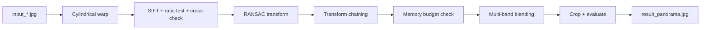

# Memory-Bounded Panorama Stitching

**원통 투영, SIFT/RANSAC 정합, 멀티밴드 블렌딩을 직접 연결한 OpenCV 파노라마 스티칭 파이프라인**

5장의 좌→우 입력 이미지를 넓은 화각의 파노라마로 합성합니다. 품질만 높이는 데서 그치지 않고, 비정상적으로 큰 캔버스가 만들어질 때 합성을 중단하도록 **1,000만 픽셀 메모리 예산**과 회귀 테스트를 함께 두었습니다.

## Pipeline



## Engineering Decisions

- **Cylindrical projection** — 넓은 수평 화각에서 평면 투영 왜곡을 줄입니다.
- **SIFT + 양방향 검증** — Lowe ratio test와 cross-check를 통과한 대응점만 사용합니다.
- **RANSAC fallback** — similarity를 우선하고, 품질이 낮을 때 affine/homography를 비교합니다.
- **Memory guardrail** — 계산된 캔버스가 `MAX_CANVAS_PIXELS = 10_000_000`을 넘으면 합성을 건너뜁니다.
- **In-place pyramid reuse** — 가중치 정규화와 Laplacian pyramid 버퍼를 재사용해 피크 메모리를 줄입니다.
- **Result selection** — inlier, fill ratio, sharpness, geometric consistency를 함께 평가합니다.

## Run

```bash
python -m pip install -r requirements.txt
python panorama_stitcher.py
```

스크립트는 같은 폴더의 `input_1.jpg`, `input_2.jpg`, ... 파일을 숫자 순서로 읽습니다. EXIF 초점거리를 찾지 못하면 28/35/50mm 후보를 실행한 뒤 점수가 가장 높은 결과를 `result_panorama.jpg`로 저장합니다.

## Tests

```bash
python -m unittest test_panorama_memory.py
```

현재 회귀 테스트 5개는 다음 경계를 확인합니다.

- 단일 밴드 pyramid 입력 버퍼 재사용
- 가중치의 in-place 정규화와 합 1 보장
- Laplacian pyramid 복원 오차
- 가중 pyramid 누적 버퍼 재사용
- 정상/비정상 캔버스에 대한 메모리 예산 판정

## Scope and Limitations

- 입력은 겹침이 충분한 좌→우 촬영 순서를 전제로 합니다.
- 움직이는 피사체, 노출 차이, 시차가 큰 장면에서는 ghosting이나 정합 실패가 생길 수 있습니다.
- 현재 샘플은 수업·연구용이며, 대규모 벤치마크나 실시간 처리 성능을 주장하지 않습니다.
- 결과 이미지는 실행 산출물이므로 기본적으로 Git에 포함하지 않습니다.

## Files

| File | Purpose |
|---|---|
| `panorama_stitcher.py` | 전체 스티칭·평가 파이프라인 |
| `test_panorama_memory.py` | 메모리 회귀 테스트 5개 |
| `input_*.jpg` | 재현용 입력 이미지 |
| `requirements.txt` | 최소 실행 의존성 |

