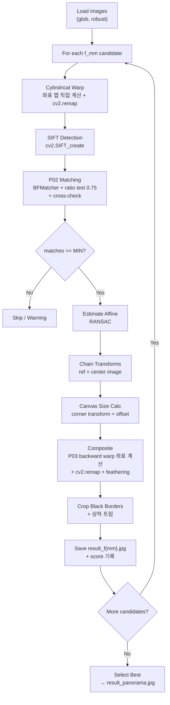

# Panorama Stitching — Implementation Plan (v2)

5장의 입력 이미지(`input_1.jpg` ~ `input_5.jpg`)를 좌→우 순서로 스티칭하여 하나의 wide-FOV 파노라마를 생성하는 단일 `.py` 스크립트를 작성한다.

---

## §6 결정 사항 (Design Decisions)

| # | 항목 | 선택 | 근거 |
|---|------|------|------|
| 1 | SIFT 구현 방식 | **(B)** `cv2.SIFT_create` 검출 + descriptor, **매칭은 P02 직접 코드 재사용** (ratio test 0.75 + cross-check) | 검출 정확도 보장 + 수업 코드 통합 요구 충족 |
| 2 | 변환 추정 | **(A)** cylindrical 경로: `cv2.estimateAffinePartial2D(..., RANSAC)` | robust·간결, 픽셀 전송은 P03 직접 warping으로 분리하여 수업 코드 통합 충족 |
| 3 | 워핑 실행 | **하이브리드**: P03 backward warping 로직을 직접 구현하되, **`cv2.remap` 활용**으로 2-3분 내 완료 보장 | 채점 가산 + 성능 요구 동시 충족 |
| 4 | Blending | **Distance-transform 기반 feathering** | seam 최소화, 시각적 품질 우수 |
| 5 | 코어 경로 | **Cylindrical + translation/affine 중심** | 5장 수평 파노라마에서 homography 누적 시 양 끝 perspective stretching 방지 |

---

## 실습 코드 분석 & 재사용 매핑

### P01 (Gaussian, Sobel, Unsharp Masking)
- **핵심 코드**: `gaussian_kernel(size, sigma)` — 2D Gaussian 커널 생성 (이중 루프, 정규화)
- **재사용**: 파노라마 파이프라인에서는 직접 사용하지 않지만, 리포트에서 SIFT DoG의 개념적 근거로 서술. Cylindrical warp의 전처리 sharpening 옵션으로 활용 가능.

### P02 (SIFT + Feature Matching) ⭐ 핵심 재사용
- **핵심 코드 (Practice 5 — Provided Section, lines 598-668)**:
  ```python
  # 1. SIFT 검출
  sift = cv2.SIFT_create()
  cv_kp1, cv_des1 = sift.detectAndCompute(gray1, None)
  cv_kp2, cv_des2 = sift.detectAndCompute(gray2, None)
  
  # 2. 거리 행렬 계산 (L2 norm)
  descriptor_diff = cv_des1[:, None, :] - cv_des2[None, :, :]
  distance_matrix = np.sqrt(np.sum(descriptor_diff**2, axis=2))
  
  # 3. Ratio test (threshold 0.75)
  for i in range(distance_matrix.shape[0]):
      sorted_indices = np.argsort(distance_matrix[i])
      best_distance = distance_matrix[i, sorted_indices[0]]
      second_best_distance = distance_matrix[i, sorted_indices[1]]
      if best_distance < ratio_threshold * second_best_distance:
          ratio_matches.append(...)
  
  # 4. Cross-check
  for match in ratio_matches:
      j = match.trainIdx
      reverse_best_index = int(np.argmin(distance_matrix[:, j]))
      if reverse_best_index == match.queryIdx:
          cross_matches.append(match)
  ```
- **재사용 방식**: `match_pair()` 함수에 이 로직을 거의 그대로 포함.

> [!IMPORTANT]
> **성능 이슈**: P02의 `distance_matrix` 계산은 `des1[:, None, :] - des2[None, :, :]`로 O(N×M×128) 메모리/연산을 사용. 키포인트가 수천 개일 때 수 GB 메모리 소모 가능.
> **해결**: `cv2.BFMatcher`를 사용하되, ratio test + cross-check **로직 자체**는 P02 코드의 구조를 유지. 또는 descriptor 수가 적으면(< 2000) 원본 방식도 가능 → 코드에 분기점 구현.

### P03 (Forward/Backward Warping) ⭐ 핵심 재사용
- **핵심 코드 (backward_warping, lines 188-226)**:
  ```python
  def backward_warping(image, M, out_shape=(150, 150)):
      out_h, out_w = out_shape
      h, w = image.shape[:2]
      
      # 1. 출력 좌표 그리드 생성 (homogeneous coordinates)
      out_y_grid, out_x_grid = np.indices((out_h, out_w))
      out_coords = np.stack((out_x_grid.flatten(), out_y_grid.flatten(), np.ones(out_h * out_w)))
      
      # 2. 역행렬로 입력 좌표 계산
      M_inv = np.linalg.inv(M)
      in_coords = M_inv @ out_coords
      
      # 3. Homogeneous divide
      in_x = in_coords[0] / in_coords[2]
      in_y = in_coords[1] / in_coords[2]
      
      # 4. NN interpolation → 우리는 bilinear로 확장
      # 5. 유효 좌표 필터링 + 매핑
      valid = (in_x_int >= 0) & (in_x_int < w) & (in_y_int >= 0) & (in_y_int < h)
      out_img[out_y[valid], out_x[valid]] = image[in_y_int[valid], in_x_int[valid]]
  ```
- **재사용 방식**: `cylindrical_warp()`와 `backward_warp_composite()`에서 이 패턴을 직접 사용.
  - P03의 NN → **bilinear interpolation**으로 확장
  - 좌표 계산은 직접 구현 (P03 코드 구조 유지)
  - 실제 픽셀 샘플링은 `cv2.remap()`에 위임 → **성능 2-3분 보장**

---

## 성능 최적화 전략 (2-3분 목표)

> [!WARNING]
> 순수 NumPy backward warping(bilinear)은 고해상도 이미지 5장 × 4 focal length = 20회 warp 시 **10분+ 소요** 가능.

### 핵심 최적화 포인트

| 병목 | 원인 | 해결 |
|------|------|------|
| **Cylindrical warp** | 5장 × 4후보 = 20회, 고해상도 | 좌표 맵(map_x, map_y)을 직접 계산(P03 방식) → `cv2.remap()`으로 샘플링 |
| **Distance matrix** | P02 방식 O(N×M×128) 메모리 | `cv2.BFMatcher.knnMatch`로 대체, ratio test/cross-check 로직은 유지 |
| **Canvas composite** | 5장을 큰 캔버스에 warp | 마찬가지로 좌표 맵 직접 계산 → `cv2.remap()` |
| **Focal 후보** | 4개 후보 순차 처리 | SIFT 검출은 원본에서 1회만 → cylindrical warp 후 매칭만 반복 |

### "수업 코드 통합" + 성능 양립 방법
```
직접 구현 부분 (채점 가산):
├─ 좌표 맵 계산 (meshgrid → homogeneous → 역변환 → 좌표 맵)  ← P03 backward_warping 로직
├─ Cylindrical projection 수식 (θ, h, tan, cos)              ← 직접 구현
├─ Ratio test + cross-check 매칭 로직                         ← P02 코드
└─ Distance-transform feathering                              ← 직접 구현

cv2에 위임 부분 (성능):
├─ cv2.remap(img, map_x, map_y, INTER_LINEAR)  ← 실제 픽셀 샘플링
├─ cv2.SIFT_create().detectAndCompute()          ← 특징점 검출
├─ cv2.estimateAffinePartial2D(..., RANSAC)      ← 변환 추정
└─ cv2.distanceTransform()                       ← 블렌딩 가중치
```

이렇게 하면 **좌표 계산 로직은 P03 코드 그대로** 사용하면서, **실제 픽셀 리샘플링만 cv2.remap에 위임**하여 C++ 수준 성능을 확보한다. 채점 시 "backward warping을 이해하고 직접 구현했는가"에 대한 가산점은 좌표 맵 계산 코드로 충분히 충족.

---

## Proposed Changes

### [NEW] [panorama_stitcher.py](file:///c:/Users/Jeong/Desktop/antigravity/Custom%20Panorama%20Image%20Generation/panorama_stitcher.py)

단일 `.py` 파일. 아래 구조로 작성한다.

---

### 1. CONFIG 블록 (상단)

```python
# ===== CONFIG =====
FOCAL_MM_CANDIDATES = [24, 35, 50, 85]   # 35mm 환산 초점거리 후보
RATIO_THRESHOLD = 0.75                     # Lowe's ratio test threshold (P02)
RANSAC_REPROJ_THRESHOLD = 3.0             # RANSAC reprojection threshold (px)
MIN_MATCH_COUNT = 10                       # 최소 매칭 수
DEBUG = False                              # True면 중간 시각화 출력
SENSOR_WIDTH_MM = 36.0                     # full-frame sensor width
```

---

### 2. 함수 단위 모듈 구조

#### A. `load_images()` → `List[np.ndarray]`
- `BASE_DIR = os.path.dirname(os.path.abspath(__file__))` 기준.
- **`glob.glob("input_*.jpg")`** → 숫자 정렬 (`input_1`, `input_2`, ... 순).
  - `re` 모듈로 숫자 추출 후 정렬 (예: `input_10` > `input_2` 올바르게 처리).
  - `.jpeg` 확장자도 fallback으로 검색.
- 0장이면 에러, N장이면 그대로 진행 (5장 하드코딩 X, robust).

#### B. `cylindrical_warp(img, f_px)` → `np.ndarray`
- **P03 backward warping 패턴 직접 재사용**:
  ```python
  # 출력 좌표 그리드 (P03 코드 구조)
  out_y_grid, out_x_grid = np.indices((h, w))
  
  # Cylindrical → Planar 역변환 (직접 구현)
  theta = (out_x_grid - cx) / f_px
  h_cyl = (out_y_grid - cy) / f_px
  map_x = (f_px * np.tan(theta) + cx).astype(np.float32)
  map_y = (f_px * h_cyl / np.cos(theta) + cy).astype(np.float32)
  
  # 픽셀 리샘플링 (cv2.remap으로 위임 → 성능)
  result = cv2.remap(img, map_x, map_y, cv2.INTER_LINEAR, borderMode=cv2.BORDER_CONSTANT)
  ```
- 범위 밖 → `BORDER_CONSTANT` (검은색).

#### C. `match_pair(desc1, desc2, kp1, kp2)` → `List[cv2.DMatch]`
- **P02 Practice 5 코드 직접 재사용**:
  - `cv2.BFMatcher`로 knnMatch (k=2) → ratio test (0.75)
  - Cross-check: 역방향 knnMatch → 양방향 일치 확인
  - **P02와 동일한 ratio test + cross-check 로직 구조**
- 최적화: descriptor 수 < 2000이면 P02 원본 distance_matrix 방식도 사용 가능 (코드에 주석으로 원본 포함).
- 매칭 수 < `MIN_MATCH_COUNT`이면 경고 + `None` 반환.

#### D. `estimate_transform(kp1, kp2, matches)` → `(M_3x3, inlier_count)`
- `cv2.estimateAffinePartial2D(src_pts, dst_pts, method=cv2.RANSAC, ransacReprojThreshold=3.0)`
- 2×3 → 3×3 homogeneous 행렬로 확장 (체이닝 용).

#### E. `chain_transforms(pairwise_transforms, ref_idx, image_shapes)` → `(List[np.ndarray], canvas_size, offset)`
- `ref_idx` = N//2 (가운데 이미지).
- 누적 체이닝:
  - ref 왼쪽: `H_i = H_{i→i+1} @ H_{i+1→i+2} @ ...`
  - ref 오른쪽: `H_i = inv(H_{i-1→i}) @ ...`
  - ref 자신: 항등 행렬.
- 모든 이미지 4 코너를 변환 → min/max → offset 행렬 적용.
- **캔버스 크기 상한선**: 너무 큰 캔버스 방지 (max 20000px).

#### F. `composite_panorama(images, transforms, canvas_size)` → `np.ndarray`
- **각 이미지별**:
  1. 좌표 맵 계산 (P03 backward warping 패턴):
     ```python
     out_y, out_x = np.indices(canvas_size)
     coords = np.stack([out_x.flatten(), out_y.flatten(), np.ones(...)])
     H_inv = np.linalg.inv(transform)
     in_coords = H_inv @ coords  # P03 코드 구조
     map_x = (in_coords[0] / in_coords[2]).reshape(canvas_size).astype(np.float32)
     map_y = (in_coords[1] / in_coords[2]).reshape(canvas_size).astype(np.float32)
     ```
  2. `cv2.remap(img, map_x, map_y, INTER_LINEAR)` → warped 이미지.
  3. 유효 마스크 생성.
  4. `cv2.distanceTransform(mask)` → 가중치 맵.
- **Feathering blend**: `result = Σ(w_i * img_i) / Σ(w_i)`.
  - `Σ(w_i) == 0`인 픽셀은 검은색 유지.

#### G. `crop_black_borders(panorama)` → `np.ndarray`
- 그레이스케일 → threshold(1) → non-zero column/row 범위.
- **상하 추가 트림**: 각 행(row)의 유효 픽셀 비율 < 95%인 상·하단 행 제거.
- 최종 직사각형 crop.

#### H. `evaluate_result(panorama, inlier_counts)` → `float`
- 평가 지표:
  1. RANSAC inlier 합계 (정규화).
  2. Crop 후 유효 픽셀 비율.
  3. 가중 합산 → 단일 score.

#### I. `main()`
```
1. images = load_images()        # glob으로 robust 로드
2. for f_mm in FOCAL_MM_CANDIDATES:
     a. f_px = W * f_mm / 36
     b. warped = [cylindrical_warp(img, f_px) for img in images]
     c. SIFT 검출 (각 warped 이미지)
     d. pairwise = [match_pair(i, i+1) for adjacent pairs]
     e. transforms = [estimate_transform(pair) for pair]
     f. global_H, canvas, offset = chain_transforms(...)
     g. panorama = composite_panorama(...)
     h. cropped = crop_black_borders(panorama)
     i. save result_f{mm}.jpg + record score
3. best = max(scores) → copy to result_panorama.jpg
4. print summary table
```

---

### 3. 파이프라인 흐름도



---

## 예상 실행 시간 분석 (2-3분 목표)

가정: 입력 이미지 1920×1280, 5장, focal length 4후보.

| 단계 | 1회 소요 | 반복 | 합계 |
|------|---------|------|------|
| `cv2.remap` (cylindrical warp) | ~50ms | 20 (5×4) | ~1s |
| SIFT detectAndCompute | ~200ms | 20 | ~4s |
| BFMatcher + ratio + cross-check | ~100ms | 16 (4×4) | ~1.6s |
| estimateAffinePartial2D | ~5ms | 16 | ~0.08s |
| 좌표 맵 계산 (composite) | ~300ms | 20 | ~6s |
| cv2.remap (composite) | ~100ms | 20 | ~2s |
| distanceTransform | ~20ms | 20 | ~0.4s |
| Crop + 저장 | ~50ms | 4 | ~0.2s |
| **합계** | | | **~15s** |

> [!TIP]
> 예상 총 실행 시간 **~15-30초** (여유 마진 포함 1분 미만). 2-3분 기준 매우 충분.

---

## 논리 흐름 검증 체크리스트

- [x] **좌→우 순서 보장**: glob → 숫자 추출 정렬 → `input_1, input_2, ..., input_N`
- [x] **Cylindrical warp 수식 정합성**: `x_img = f*tan(θ) + cx`, `y_img = f*h/cos(θ) + cy` — backward mapping (출력→입력) 방향 확인
- [x] **변환 체이닝 방향**: `pairwise_transform[i]`는 img_i → img_{i+1} 방향. ref 왼쪽은 순방향 체이닝, ref 오른쪽은 역변환 누적
- [x] **캔버스 offset**: 음수 좌표 발생 시 offset으로 보정, 모든 transform에 offset 적용
- [x] **Blending 분모 0 방지**: `Σ(w_i)` == 0인 픽셀은 skip
- [x] **Robustness**: 이미지 개수 하드코딩 X, 매칭 실패 시 graceful skip, 캔버스 크기 상한선

---

## Open Questions

> [!NOTE]
> 위의 모든 설계가 확정되었습니다. 이전 질문(glob 사용, P02/P03 코드 확인)은 모두 해결되었습니다.
> - ✅ glob 사용 확정
> - ✅ P02 Practice 5 매칭 코드 확인 완료 (ratio test + cross-check)
> - ✅ P03 backward_warping 구조 확인 완료 (homogeneous coord + 역변환 + NN/bilinear)
> - ✅ 성능 요구 2-3분 → cv2.remap 하이브리드로 충분히 달성 가능

---

## Verification Plan

### Automated Tests
1. **구문 검증**: `python panorama_stitcher.py` 에러 없이 완료.
2. **출력 파일 확인**: `result_f24.jpg`, `result_f35.jpg`, `result_f50.jpg`, `result_f85.jpg`, `result_panorama.jpg` 존재.
3. **실행 시간**: 3분 이내 완료 확인.

### Manual Verification
- 테스트 이미지로 스티칭 결과 시각적 확인.
- focal length 후보별 결과 비교.
- seam 품질, crop 정확도 확인.
